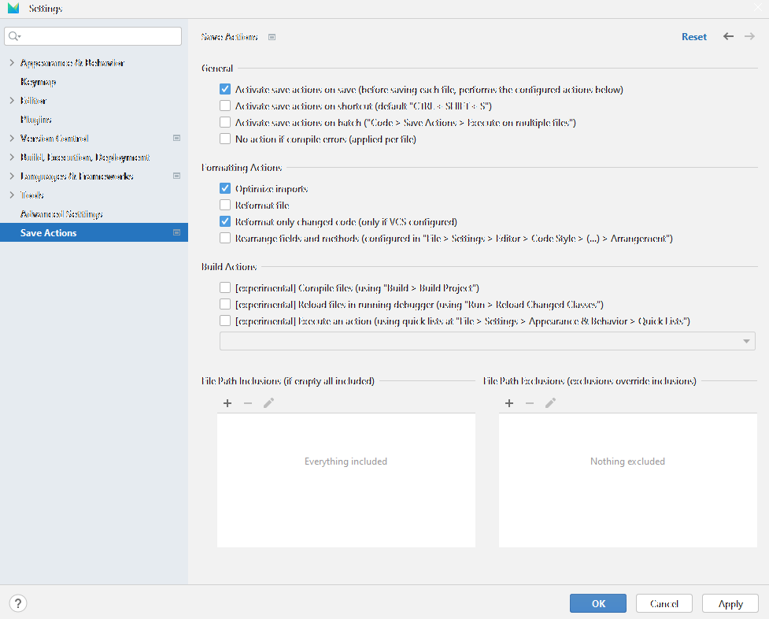
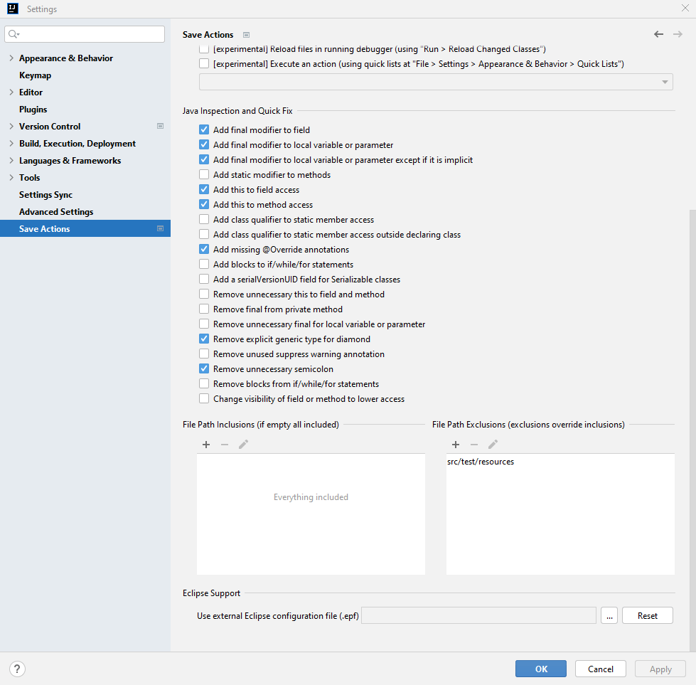

#  Save Actions X

> [!NOTE]  
> This plugin is a fork of [dubreuia/intellij-plugin-save-actions](https://github.com/dubreuia/intellij-plugin-save-actions) and [fishermans/intellij-plugin-save-actions](https://github.com/fishermans/intellij-plugin-save-actions) and is kept in maintenance mode:
> * Keep the plugin up-to-date with the latest IDEA versions
> * Distribute the plugin on the IDEA marketplace
> * Fix serious bugs
> * Keep the repo in sync with XDEV's standards
> * Hardly used features may be removed to speed up development
>
> There is no guarantee that work outside of this scope will be done.

Supports configurable, Eclipse like, save actions, including "optimize imports", "reformat code", "rearrange code", "compile file" and some quick fixes like "add / remove 'this' qualifier", etc. The plugin executes the configured actions when the file is synchronized (or saved) on disk.

Using the save actions plugin makes your code cleaner and more uniform across your code base by enforcing your code style and code rules every time you save. The settings file (see [files location](#files-location)) can be shared in your development team so that every developer has the same configuration.

The code style applied by the save actions plugin is the one configured your settings at "File > Settings > Editor > Code Style". For some languages, custom formatter (Dartfmt, Prettier, etc.) may also be triggered by the save actions plugin. See the [Editor Actions](#editor-actions) configuration for more information.

## Features

### All JetBrains products

- Optimize imports
- Run on file save, shortcut, batch (or a combination)
- Run on multiple files by choosing a scope
- Reformat code (whole file or only changed text)
- Rearrange code (reorder methods, fields, etc.)
- Include / exclude files with regex support
- Works on any file type (Java, Python, XML, etc.)
- Launch any editor action using "quick lists"
- Uses a settings file per project you can commit (see [Files location](#files-location))
- Available keymaps and actions for activation (see [Keymap and actions](#keymap-and-actions))

### Java IDE products

Works in JetBrains IDE with Java support, like Intellij IDEA and AndroidStudio.

- Compile project after save (if compiling is available)
- Reload debugger after save (if compiling is available)
- Eclipse configuration file `.epf` support (see [Eclipse support](#eclipse-support))
- Automatically fix Java inspections (see [Java quick fixes](#java-fixes))

## Installation
[Installation guide for the latest release](https://github.com/xdev-software/intellij-plugin-save-actions/releases/latest#Installation)

> [!TIP]  
> [Development versions](https://plugins.jetbrains.com/plugin/22113/versions/snapshot) can be installed by [adding the ``snapshot`` release channel as a plugin repository](https://www.jetbrains.com/help/idea/managing-plugins.html#repos): 
> ``https://plugins.jetbrains.com/plugins/snapshot/list``

## Usage

Read the [full usage guide here](./USAGE.md).

## Contributing
See the [contributing guide](./CONTRIBUTING.md) for detailed instructions on how to get started with our project.
